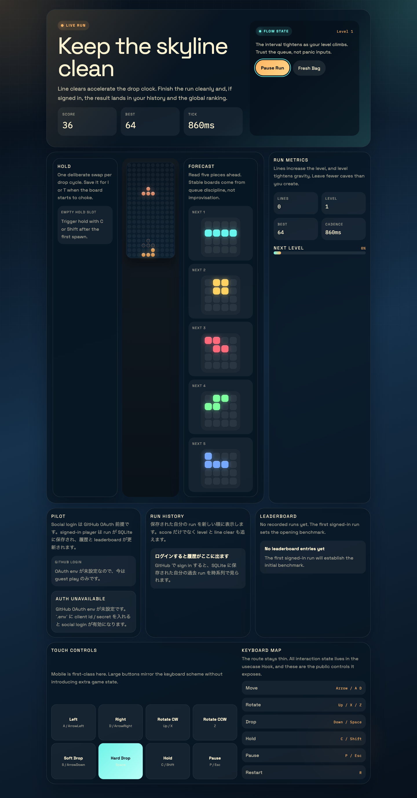

# Neon Stack Tetris

Responsive Tetris built with React Router. The app keeps the game rules in a pure domain engine, pushes keyboard and timer orchestration into a client usecase Hook, and uses GitHub social login plus SQL Server persistence for score history and competition.



## Features

- 7-bag randomizer with hold, ghost piece, soft drop, and hard drop
- score, lines, level, and gravity ramp
- GitHub social login
- SQL Server-backed run history and global leaderboard
- guest play with local fallback high score
- keyboard and touch controls for desktop and mobile
- React Router file routes with server loaders/actions
- Vitest coverage for game engine and score-recording usecase

## Stack

- React 19
- React Router 7
- Prisma ORM v7
- SQL Server / Azure SQL
- TypeScript
- Vite
- TailwindCSS v4
- Vitest

## Environment

Copy `.env.example` to `.env` and fill the GitHub OAuth values:

```bash
cp .env.example .env
```

Required variables:

- `PRISMA_DATABASE_URL`
- `SQLSERVER_HOST`
- `SQLSERVER_DATABASE`
- `SQLSERVER_AUTH_MODE`
- `SESSION_SECRET`
- `GITHUB_CLIENT_ID`
- `GITHUB_CLIENT_SECRET`

Runtime uses the `mssql` / Tedious driver through Prisma's `@prisma/adapter-mssql`.

- In Azure, set `SQLSERVER_AUTH_MODE=default-azure-credential` and do not ship `SQLSERVER_USER` / `SQLSERVER_PASSWORD` with the app.
- For local development, `SQLSERVER_AUTH_MODE=sql-password` is supported.
- `PRISMA_DATABASE_URL` is reserved for Prisma CLI operations such as `prisma generate` and `prisma migrate deploy`. Keep it separate from the runtime credential path.
- For a user-assigned managed identity, set `AZURE_CLIENT_ID`. `DefaultAzureCredential` will pick it up automatically.

DefaultAzureCredential only gets an access token. Azure SQL authorization still requires an Entra user mapped in the database, for example via `CREATE USER FROM EXTERNAL PROVIDER`, plus the appropriate roles.

For the GitHub OAuth app, use this callback URL in local development:

```text
http://localhost:5173/auth/github/callback
```

## Development

Install dependencies and start the app:

```bash
npm install
npm run db:generate
npm run db:migrate
npm run dev
```

Default local URL:

```text
http://localhost:5173
```

## Quality Gates

```bash
npm test
npm run typecheck
npm run build
```

## Controls

| Action | Keys |
| --- | --- |
| Move left / right | `ArrowLeft` / `ArrowRight`, `A` / `D` |
| Soft drop | `ArrowDown`, `S` |
| Hard drop | `Space` |
| Rotate clockwise | `ArrowUp`, `X` |
| Rotate counter clockwise | `Z` |
| Hold piece | `C`, `Shift` |
| Pause | `P`, `Escape` |
| Restart | `R` |

## Architecture

```text
app/
  routes/                     Route composition only
  components/tetris/         Presentational UI
  lib/client/usecase/tetris/ Client interaction flow
  lib/client/infrastructure/ Browser adapters
  lib/contracts/             Shared DTO contracts
  lib/domain/                Pure game rules and repository ports
  lib/server/usecase/        Server orchestration
  lib/server/infrastructure/ Prisma, sessions, OAuth gateway
```

The domain engine lives in [app/lib/domain/services/tetris-engine.ts](./app/lib/domain/services/tetris-engine.ts), the main screen orchestration lives in [app/lib/client/usecase/tetris/use-tetris.ts](./app/lib/client/usecase/tetris/use-tetris.ts), and score persistence flows through [app/lib/server/usecase/tetris/record-score-run.server.ts](./app/lib/server/usecase/tetris/record-score-run.server.ts).

## Azure Deployment Notes

- Runtime authentication is designed for `DefaultAzureCredential`, which means Managed Identity on Azure is the recommended production path.
- Prisma migrations should run with a separate deployment credential through `PRISMA_DATABASE_URL`; do not grant schema-change privileges to the runtime identity.
- The runtime identity only needs data access on the target tables after migrations have finished.

## Container Release

- Publishing a GitHub release triggers [release-container-image.yml](./.github/workflows/release-container-image.yml).
- The workflow builds `Dockerfile` and pushes the image to `ghcr.io/anaregdesign/tetris`.
- Every published release gets a tag matching the GitHub release tag and a short `sha-*` tag.
- Non-prerelease releases also refresh the `latest` tag.
